# Introducción {#tse01}

> … **¿por qué R en SegmentaNet?**

Parece algo contrario a lo que es la filosofía de trabajo de SegmentaNet, el dar la oportunidad de trabajar con programación (básica, pero al fin y al cabo programación) pero creemos poder dar una respuesta simple y clara, aunque sea formulando una nueva pregunta, ¿no es acaso necesario y nos viene muy bien el poder utilizar macros en software como Microsoft Office o sintaxis en SPSS? Pues esta es la respuesta y la razón de ofrecer en los planes 4GB y PREMIUM  la posibilidad de que el usuario pueda utilizar código R [@R] en sus análisis de datos, que le permitan ir mucho más allá de lo que ofrece SegmentaNet. Además, la elección de R no es casual. R se ha convertido en uno los de los estándares de facto de la industria del proceso, análisis y visualización de datos, dentro de ese nuevo ámbito que es al analítica o ciencia de datos, que está dando cabida a muchos profesionales de nueva creación y en la que nos estamos integrando muchos otros que provenimos de ámbitos diferentes. Es un estándar de la industria y está muy documentado en Internet, por lo que no debes tener muchos problemas para encontrar documentación al respecto.

## Preparar nuestro entorno

En nuestra infraestructura, R está integrado con SegmentaNet y no debes tener preocupación alguna acerca de su instalación o mantenimiento. Sólo debes indicar con qué paquetes quieres trabajar y listo. Si el paquete no está disponible en SegmentaNet, lo deberás comunicar en [consultas@segmentanet.com](mailto:consultas@segmentanet.com) para que sea instalado. Como usuario no puedes añadir paquetes.

Pero vamos a trabajar con ello y verás que sencillo. Para comenzar, te aconsejamos crear un proyecto en el que añadiremos la fuente de datos que puedes descargar desde [este enlace](https://drive.google.com/a/investigaonline.com/file/d/1JjevbQjzGc1NMyR7qf7bbvtbMyK8Pvhr/view?usp=drive_web). Esta fuente de datos está en formato SPSS (sav) y se corresponde con la tercera oleada de un estudio del CIS de 2017, el barómetro sanitario. 

### Crear proyecto

Así pues crea un proyecto desde el botón **`|+ Proyecto|`** del escritorio inicial de SegmentaNet e introduce estos datos (o los que quieras)..

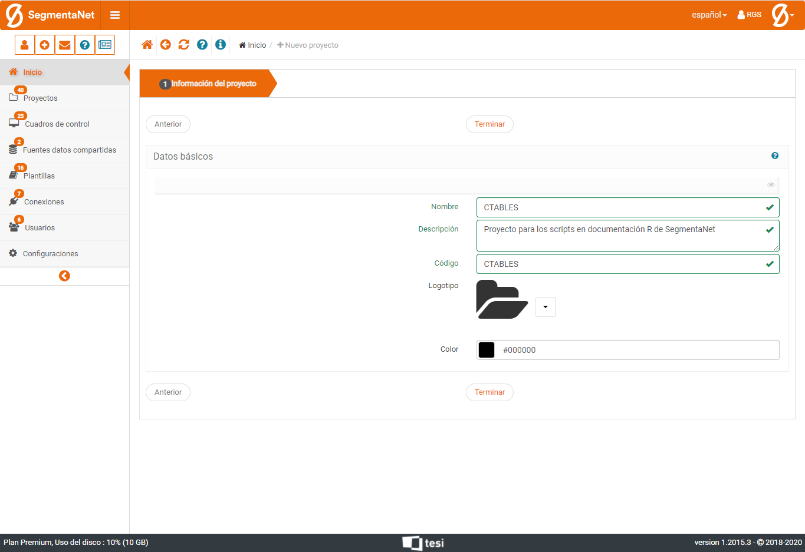

Tras acabar la inserción de esos datos, se indica que el proyecto no tiene fuentes de datos (conexión a algún banco de datos)

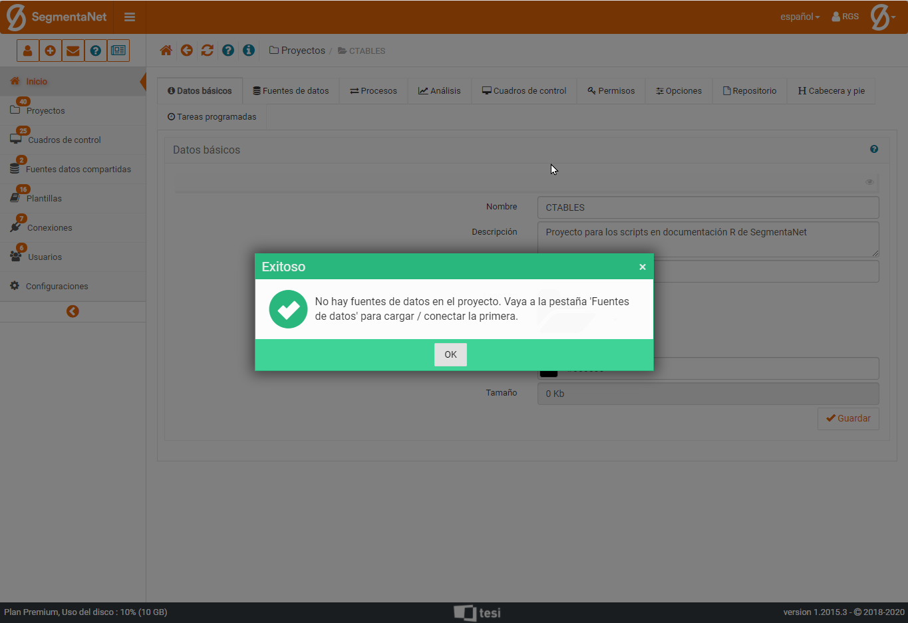

### Crear fuente de datos

Este es el momento de incluir la fuente de datos que indicábamos del **estudio CIS** [SPSS](https://drive.google.com/a/investigaonline.com/file/d/1JjevbQjzGc1NMyR7qf7bbvtbMyK8Pvhr/view?usp=drive_web). Descárgala y procede a su subida. Haz clic en la pestaña fuente de datos y también en **`|+ Nueva fuente de datos|`** ...

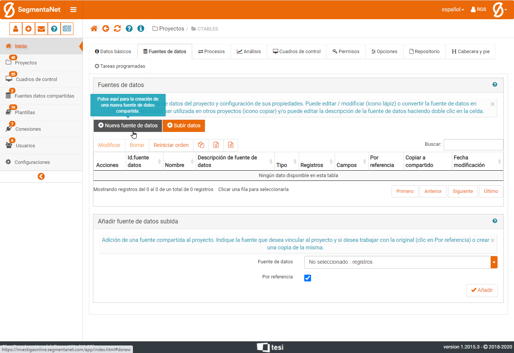

Sigue los pasos que aquí indicamos ...

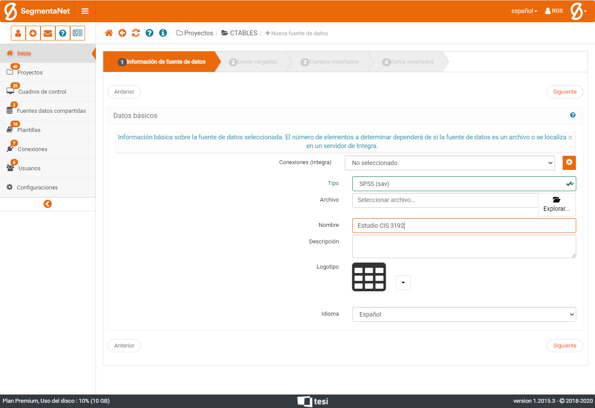

**`|Siguiente|`**

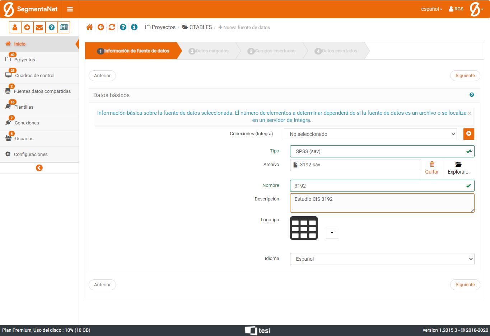

**`|Siguiente|`**

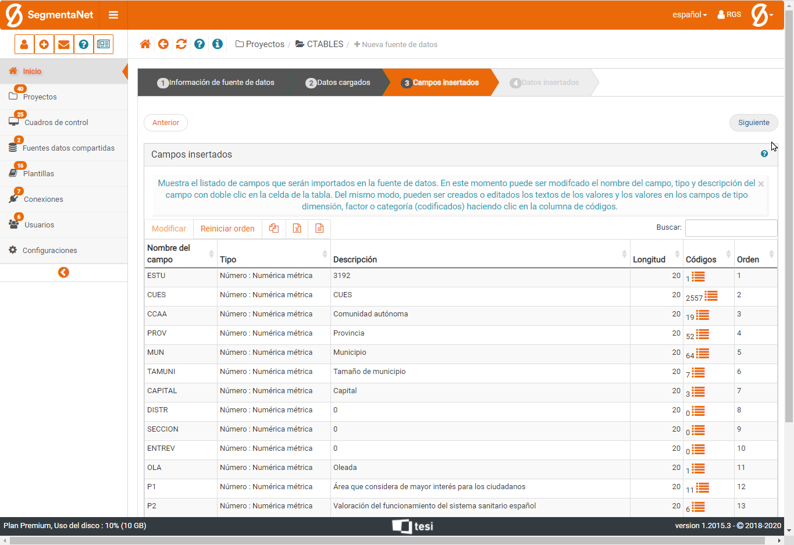

**`|Siguiente|`**

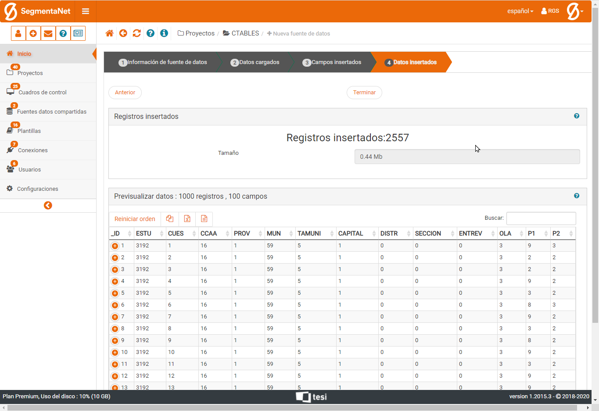

**`|Siguiente|`**

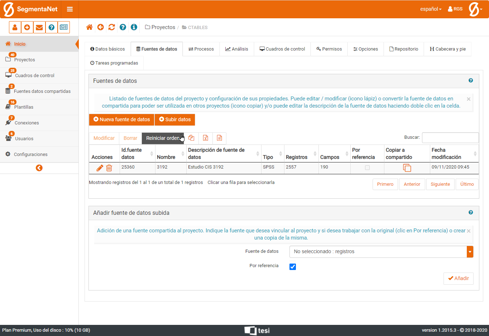

Y ha finalizado la creación de la fuente de datos.

En este momento ya tenemos creado el proyecto, subida nuestra fuente de datos y estamos en condiciones de comenzar a escribir scripts para tablas y/o gráficos. Si necesitas más ayuda en este aspecto, puedes consultar estos vídeos genéricos relacionados.

* [Crear un proyecto](https://youtu.be/Wv3em6D1lkc)
* [Añadir un fuente de datos a un proyecto](https://youtu.be/rhCcsk4Pe_k)
* [Crear un análisis -de tipo scripting avanzado-](https://youtu.be/Z-lAx5Mq-ek)

Como puedes observar, la fuente de datos tiene 2557 registros y tiene 190 campos. Si deseas ver el cuestionario que originalmente se utilizó para recoger los datos, [lo puedes descargar aquí](https://drive.google.com/a/investigaonline.com/file/d/1AUUI-1isOmKB1ovR4MRoqMj2Fp7Re2f2/view?usp=drive_web). En él puedes ver todo lo referente a como se ha realizado la entrevista.


## Mi primer análisis con scripting

Bien, pues vamos a ello. Vamos a comenzar por la base. Creamos un análisis en este proyecto, completamos su nombre y descripción, y elegimos el tipo scripting avanzado. 

### Crear análisis

Para ello accedemos a la pestaña de análisis ...

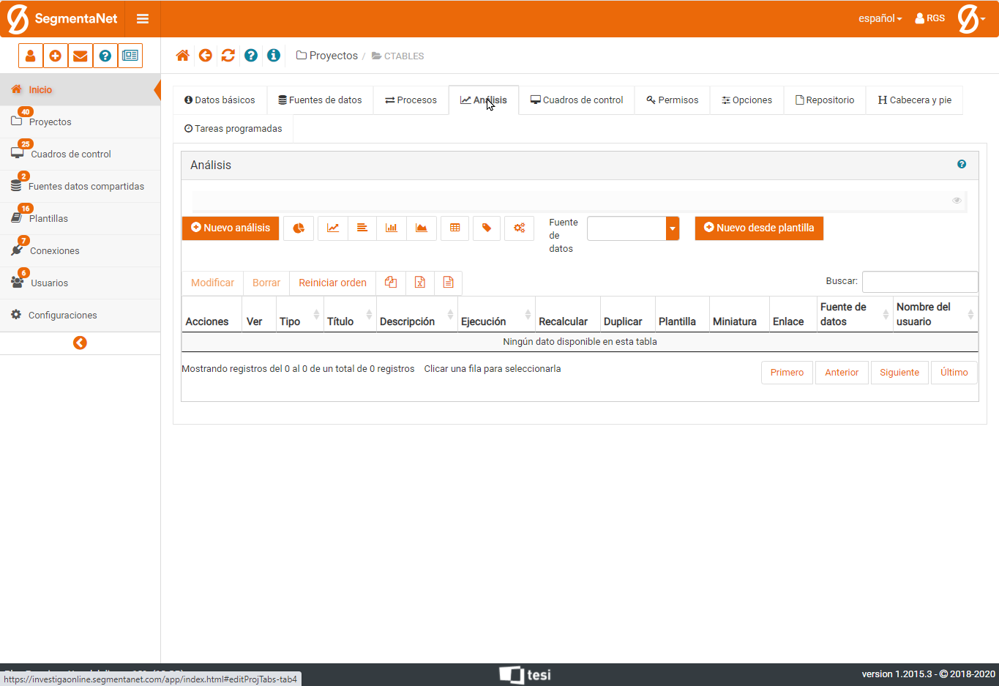

... y solicitamos la creación de un nuevo análisis

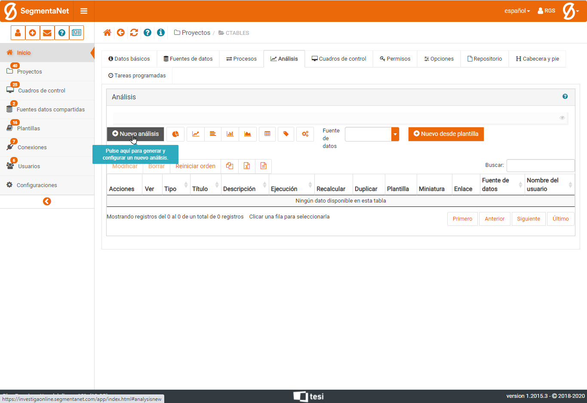


... donde iremos indicando los elementos del mismo necesarios. Es aquí donde deberemos seleccionar de entre la lista de análisis propuestos, la tipología que desemaos, que en nuestro caso es el **Scripting avanzado (markdwon)**.

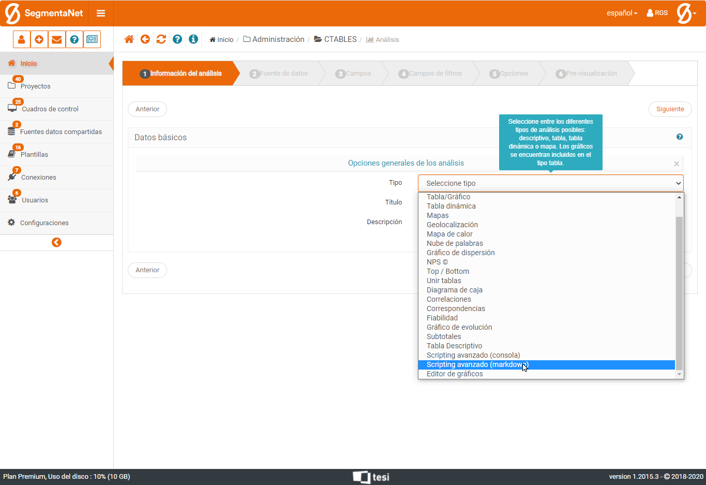

Al seleccionar el tipo de análisis indicado, se desencadena un proceso de asistentes que nos llevarán a poder determinar el tipo de análisis. La primera selección tras el tipo de análisis será cuál es nuestra fuente de datos, seleccionando la fuente que acabamos de subir a nuestro proyecto. 

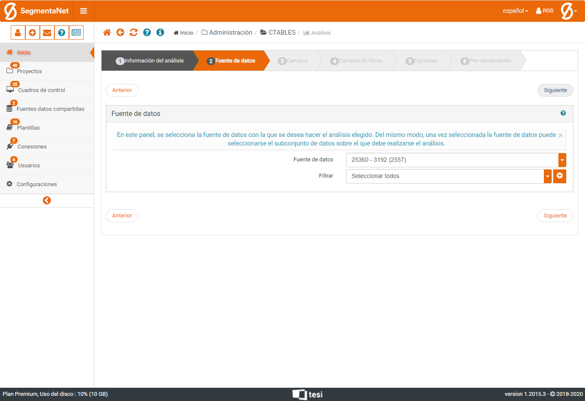

El siguiente paso consiste en elegir aquellos campos con los que se va a trabajar. Esto es muy importante. R trabaja con la información en la memoria del servidor, por lo que cuanto más optimicemos el tamaño del marco de datos (*dataframe* en el lenguaje R) todo fluirá más rápido. En el caso que nos ocupa, vamos a trabajar sólo con un campo, denominado PESO y que se ubica al final del listado. 

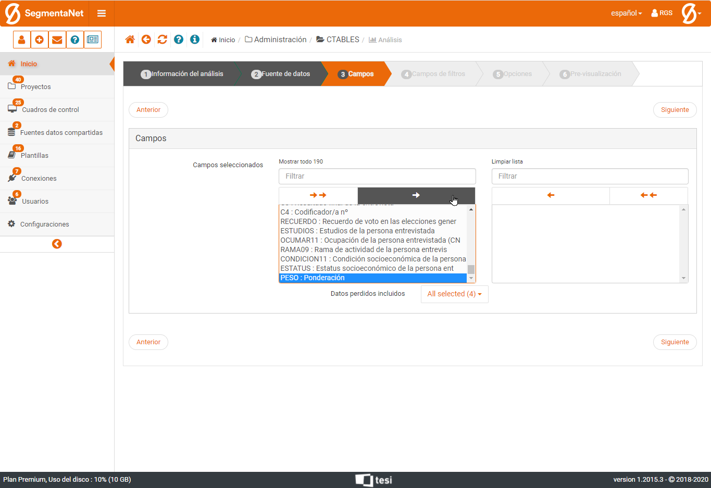

Lo seleccionamos ...

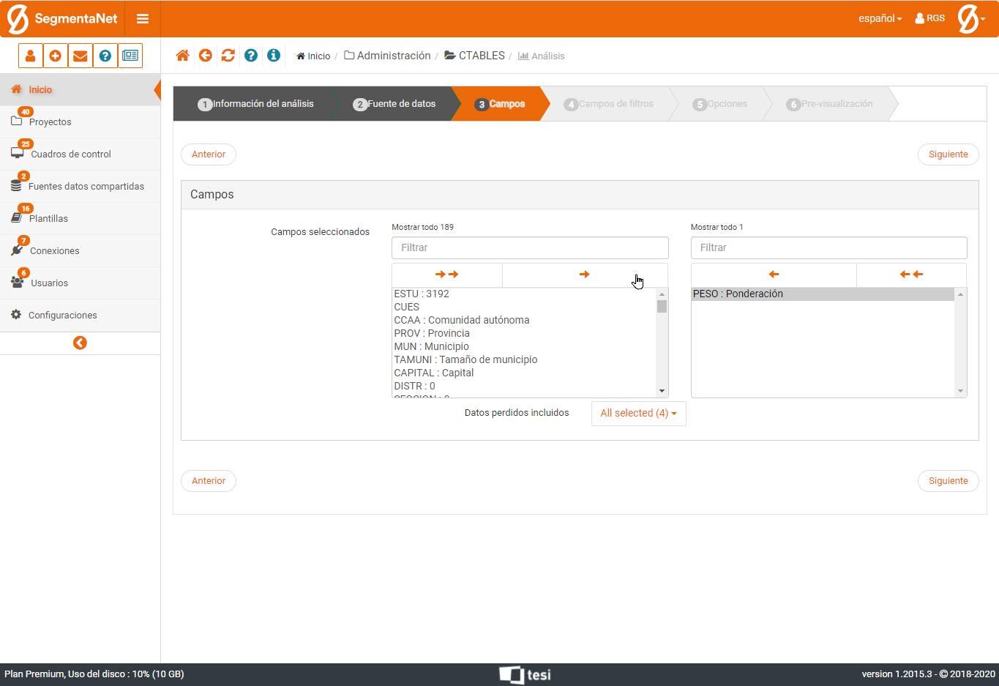

y lo pasamos a la caja de seleccionados de la derecha. 

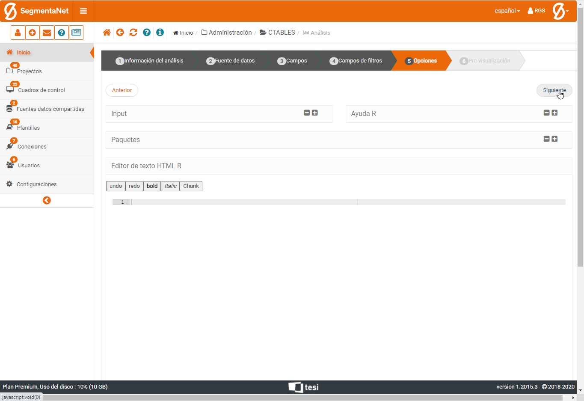

Finalizando este nuevo paso con **`|Siguiente|`**.

En la siguiente pantalla, ya escribimos el script de R, que como puedes ver en línea 1 y 3 comienza y acaba con una simbología determinada. Estos son los caracteres indicadores de que todo lo que queda entre ` ```{r echo=TRUE}` y ` ``` ` es scripting. A partir de ahora, nuestras instrucciones irán siempre entre estos símbolos de inicio y final. Nótese que se añade la instrucción echo=TRUE. Esta instrucción provocará que se imprima en el resultado los comandos del script, si en lugar de eso se escribe echo=FALSE, no se imprimiría ese código.

El script debe escribirse así

```{r c0001, fig.cap='Cálculo de la media', out.width='80%', fig.asp=.75, fig.align='center', echo=TRUE}
mean(data$PESO, na.rm=TRUE)
```

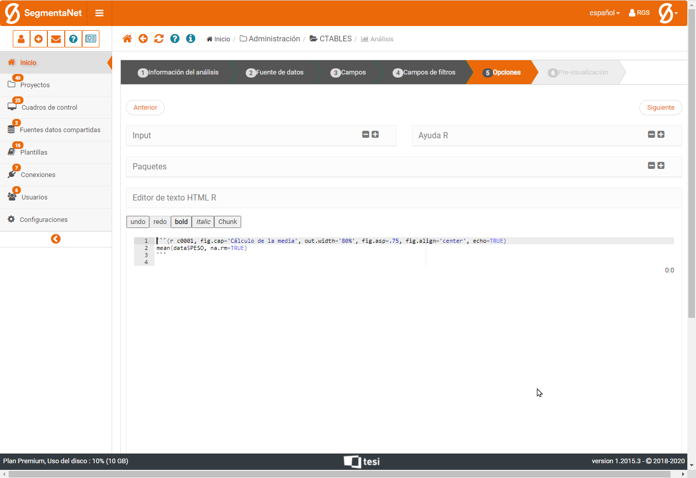

El script escrito contiene la información donde se indica:

* se calcula la media (mean);
* de una variable que está en el marco de datos denominado `data`);
* y que se llama PESO (`data$PESO`);
* no teniendo en cuenta los valores NA (nulos, no definidos, que no sean número: `na.rm=TRUE`)

El resultado, ya puedes verlo, 0,9999273. 

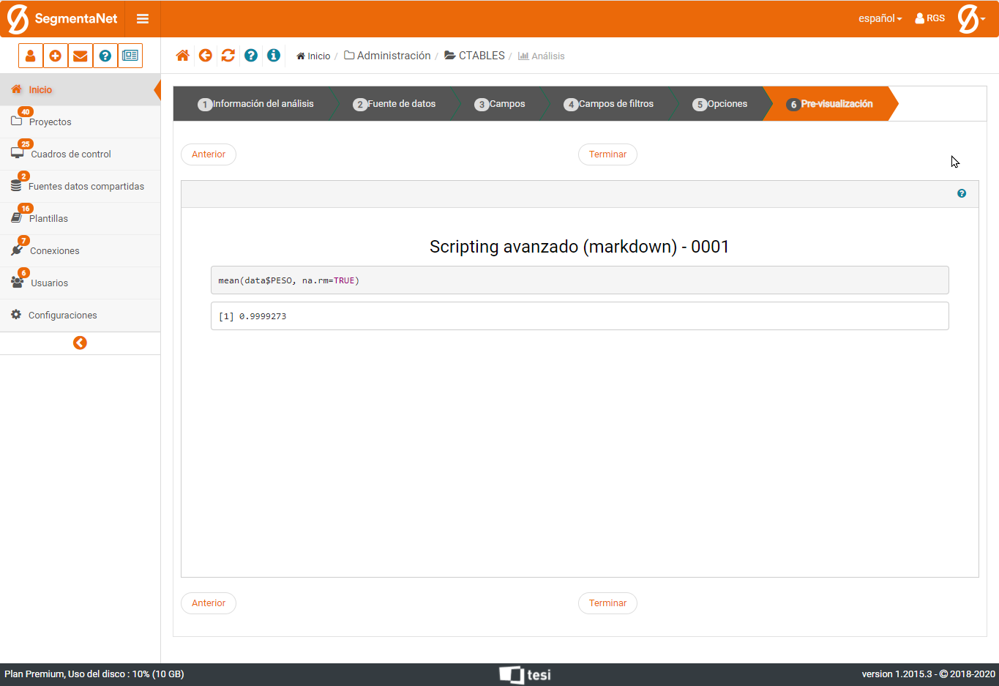

Terminamos con el análisis. Este aparece ahora en el listado de análisis realizados y podmos acceder a su posterior edición.

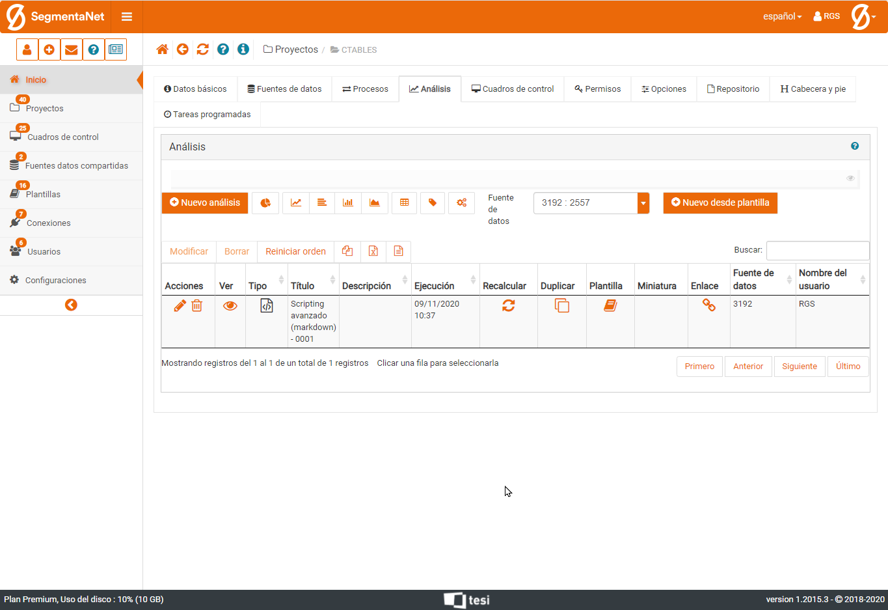

Vamos a realizar algunos cambios en nuestro script ¿Te parece que redondeemos esta cifra? Edita el análisis utilizando el icono de edición (lápiz) en la fila del gestor.

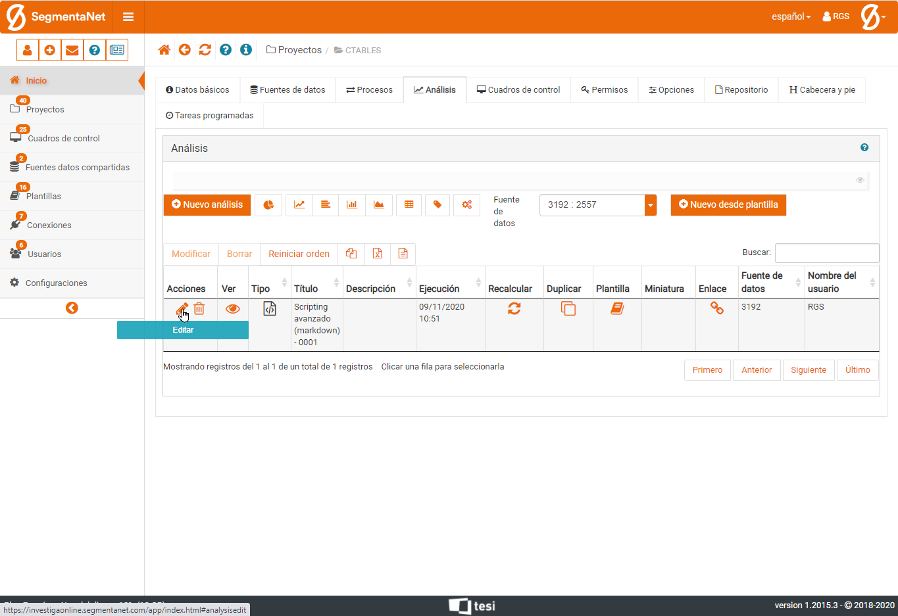

Se muestra la primera ventana del asistente ...

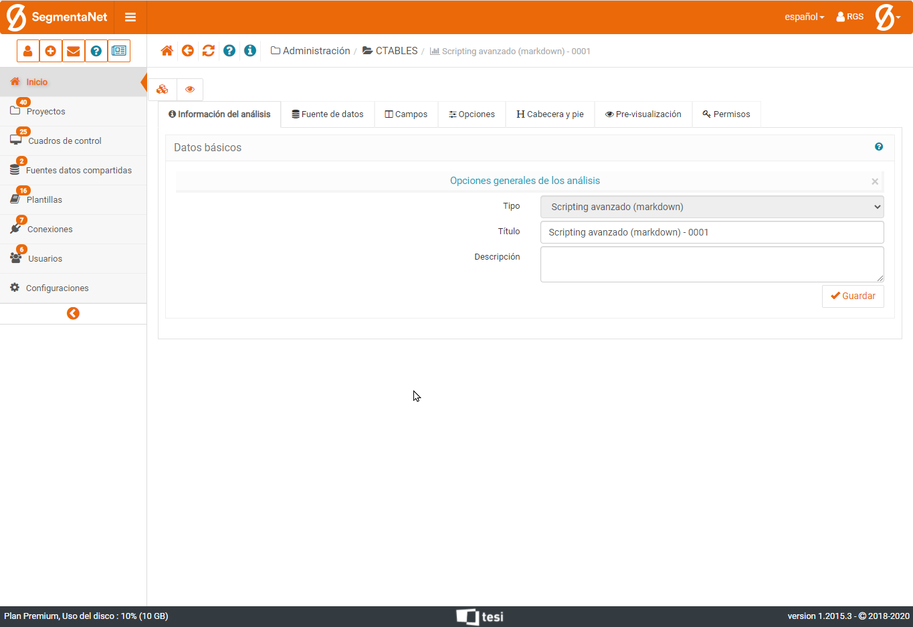

Posteriormente, pinchamos en opciones y se mostrará nuevamente el script.


Ahora, edita el texto del script y déjalo como éste

```{r c0002, fig.cap='Cálculo de la media', out.width='80%', fig.asp=.75, fig.align='center', echo=TRUE}
round(mean(data$PESO, na.rm=TRUE),2)
```

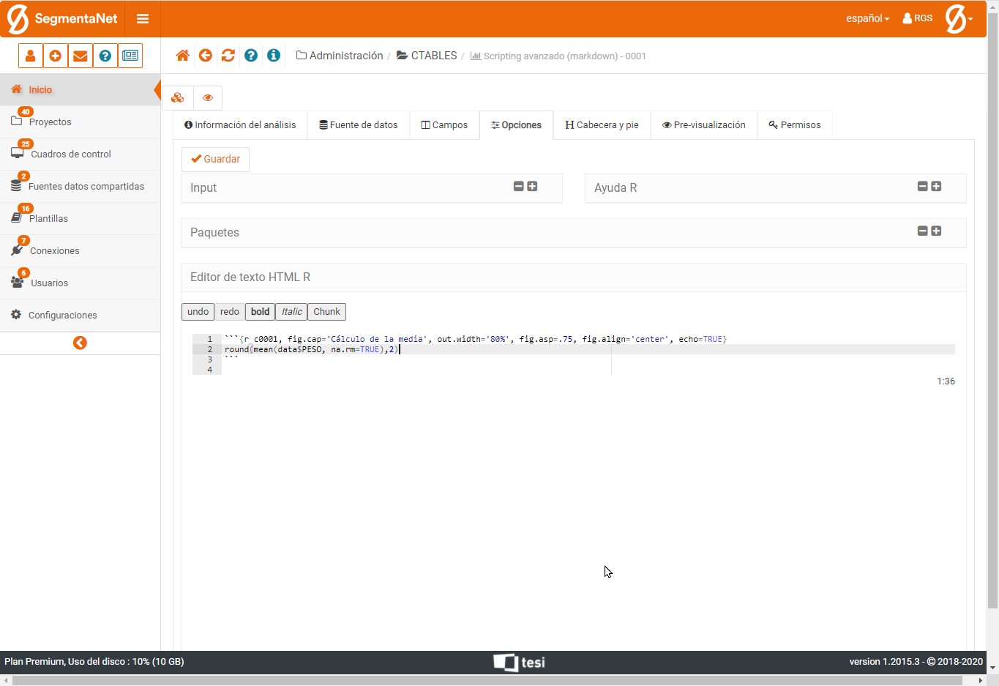

Como puedes observar, la edición ha consistido en añadir otra instrucción de R, el `round`, completando con el modificador `,2` que indica redondear a 2 decimales. El resultado es el siguiente ...

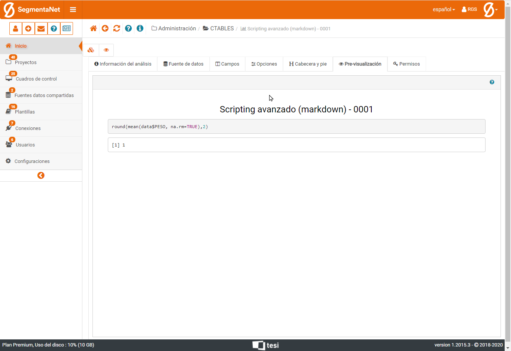

Y ya podemos nuevamente abandonar nuestro script. Nuestro cambios quedan grabados. 

### Conclusión

Así, hemos finalizado con nuestro primer *script*. Posiblemente pensarás que eso lo podías haber hecho también con un análisis descriptivo de SegmentaNet. Claro que sí, pero no nos vamos a detener aquí, vamos a seguir avanzando y aportando más. 

No volveremos a ser tan explicativos en este manual acerca de como crear y editar los scripts. La gestión de los scrips en SegmentaNet, la suponemos superada, por lo que ahora ya sólo mostraremos directamente el código de los scripts.

El siguiente paso ya será utilizando el paquete de referencia @expss. Este paquete está cargado por defecto si usas una fuente de datos alojada en SegmentaNet, pero si tratas de cargar una fuente externa (R te da esta posibilidad) lo deberás elegir como paquete a cargar desde el panel de **Paquetes** en la ventana de edición del script.

## Mi primera tabla con scripting

`expss` es un paquete desarrollado por @expss que calcula y muestra tablas con soporte para etiquetas de estilo 'SPSS', cabeceras múltiples y anidadas, pesos, variables de respuesta múltiple y pruebas de significación de tabla y celda. Ofrece facilidades para una salida formateada de tablas. Los métodos para variables etiquetadas agregan soporte de etiquetas de valor a las funciones de R base y a algunas funciones de otros paquetes. Es un paquete destinado a ayudar a las personas a cambiar el proceso de datos desde 'EXCEL' y 'SPSS' hasta R.

Vamos a crear nuestra primera tabla con scripting avanzado en SegmentaNet, utilizando una instrucción muy básica de `expss`, que evolucionará en posteriores secciones. 

Aquí dejo algunos enlaces para que puedas leer acerca de este paquete y las posibilidades que te ofrece de modo combinado con SegmentaNet:

* [manual PDF de EXPSS](https://cran.r-project.org/web/packages/expss/expss.pdf)
* [material de ayuda, ejemplos](https://cran.r-project.org/web/packages/expss/vignettes/tables-with-labels.html)
* [uso de etiquetas en R](https://cran.r-project.org/web/packages/expss/vignettes/labels-support.html)

No vamos a repetir nuevamente todos los pasos de creación del análisis. Simplemente edita el análisis anterior la pestaña de *Opciones* escribe la siguiente sentencia a continuación de la anterior. Esta es la forma básica de pedir que se calcule la media de la variable PESO en `expss` Le indicamos: la instrucción de cálculo (calculate), el marco de datos (data), el cálculo a hacer cro_mean (equivalente a calcula la media (mean) en forma de tabla (crosstab). Mira su resultado:

```{r echo=TRUE}
calculate(data, cro_mean(PESO))
```

Verás algunos cambios respecto a la salida anterior, no hemos tenido que indicar cuántos decimales, ni que redondee, ni le hemos dicho que no tenga en cuenta los valores especiales o nulos… y ha respondido de forma correcta. Ya vamos viendo que eso puede dar mucho juego, pero vamos a ir de forma ordenada y presentando poco a poco todos los tipos de tabla jugando con diferentes variables del banco de datos (¡¡¡ sí... dataframe!!!) que hemos cargado.

Comenzaremos con la creación de tablas unidimensionales o conocidas como marginales, para luego continuar con las tablas cruzadas, y entre medio, iremos incorporando medidas estadísticas. 

El capítulo 2, simplemente incorpora una serie de términos que manejamos en este manual. Da un vistazo, pero es posible que muchos de ellos ya sea habituales y conocidos por ti. Pasa pues la sección 3, donde comenzamos a trabajar los scripts.

## ¿Desde dónde creo mis scripts?

Hay diferentes lugares en SegmentaNet donde puedes utilizar scripting de código R. Hay otras partes de la plataforma que usan scripting de R, pero que no es editable por el usuario. Te explicamos brevemente la funcionalidad de las que sí puede el usuario trabajar.

### Análisis

En el menú de análisis hay dos tipos de análisis que utilizan scripting de R:

* scripting avanzado (consola)
* scripting avanzado (markdown)

Cada uno de ellos presenta particularidades distintas. 

#### Scripting avanzado (markdown)

El scripting con markdown está pensado para generar páginas completas o documentos completos con texto, tablas, gráficos, etc. Se pueden utilizar paquetes como `flexdashboard` o generar salidas de tipo diapositiva utilizando las opciones de configuración que ofrece el paquete `rmarkdown`. No aseguramos una compatibilidad al 100%, pues eso sería imposible, pero gran parte de las características estarían funcionales. La idea es generar un documento HTML, de forma totalmente transparente para el usuario que se guarda en la base de datos y se presenta como resultado del análisis. Ese HTML puede contener texto, gráficos, tablas y cualquier elemento que se te ocurra. El código R se ubica en lo que se denomina `chunks` que luego veremos y se puede incluir también código R `inline` en el texto. 

#### Scripting avanzado (consola)

El scripting avanzado con consola está pensado para obtener tablas u otros objetos manipulados sobre los que realizar una publicación en modo tabla o en modo gráfico. Se da la oportunidad al usuario de elegir qué objeto y en qué formato se debe procesar. Tanto tabla como gráfico adquieren el aspecto estándar de SegmentaNet.

### Procesos

Desde procesos, el scripting avanzado (consola) se debería usar para crear una fuente de datos que pueda ser luego utilizada de forma estándar por el usuario de SegmentaNet. Por poner un ejemplo sencillo, imaginemos un archivo público que está en una URL, lo leemos, lo procesamos con scripts de R y obtenemos nuestra fuente de datos, que será subida a SegmentaNet de forma integrada en el proceso.

## Conclusión

En este documento, nos centraremos en trabajar con los análisis de tipo scripting avanzado markdown.
