# Introducción  {#tse01}

```{r include = FALSE}
if(!knitr:::is_html_output())
{
  options("width"=56)
  knitr::opts_chunk$set(tidy.opts=list(width.cutoff=56, indent = 2), tidy = TRUE)
  knitr::opts_chunk$set(fig.pos = "H")
}
```

## ¿Por qué este libro?

La respuesta más simple a la pregunta ¿Por qué este libro? es que no hay libros dedicados a ilustrar y mostrar cómo hacer tablas de contingencia y gráficos a partir de esas tablas usando R; hablando más específicamente usando `expss` y `highcharter`. Por otro lado, a partir de mi experiencia y de muchos años dedicado al mundo de la investigación y la docencia (mi hobbie personal) encontré el tiempo y la motivación para escribirlo. Quería crear un recurso que fuera diferente del resto de textos con el mismo contenido aproximado y porque creo que para que las ideas se difundan y adopten ampliamente, deben percibirse de manera amigable y fácil de entender, lo que tiene por qué estar reñido con una baja calidad científica y teórica. Si algo se percibe como complejo e intimidante, solo pocos creerán que ese recurso es apropiado para ellos. Así pues, y aunque todos los análisis requieren las habilidades propias de una persona acostumbrada a manejar fuentes de datos variadas, creo realmente que el recurso es extremadamente sencillo, funcional, comprensible y válido para todos.

¿No es acaso necesario y nos viene muy bien el poder utilizar macros en software como Microsoft Office<sup>&copy;</sup> o sintaxis en IBM SPSS<sup>&copy;</sup> ? Pues esta es la respuesta, mostrar de una forma sencilla la posibilidad de que el usuario pueda utilizar código R [@R-base] en sus análisis de datos, que le permitan ir mucho más allá de lo que ofrecen las herramientas básicas comerciales. 

Además, la elección de R no es casual: 

* La primera razón para elegir R es que es un programa extremadamente potente para manipular y analizar datos. Su popularidad en alza lo ha convertido en el software de referencia para estadísticas y análisis en muchas disciplinas, y se enseña cada vez más en muchas universidades. R se ha convertido en uno los de los estándares de facto de la industria del proceso, análisis y visualización de datos, dentro de ese nuevo ámbito que es al analítica o ciencia de datos, que está dando cabida a muchos profesionales de nueva creación y en la que nos estamos integrando muchos otros que provenimos de ámbitos diferentes. 

* La segunda razón para seleccionar R es que es independiente de la plataforma (puede usarla en Windows<sup>&copy;</sup> , Mac o Unix) y es gratis y por ello no se deb invertir un euro en licencias, mantenimientos o actualizaciones. Los proveedores de software comercial pueden brindar soporte y ofrecer algún tipo de garantía, pero eso es secundario. No se puede superar el precio y la funcionalidad de R. R se enriquece por el hecho de que muchas personas de todo el mundo contribuyen y comparten su propio trabajo en forma de funcionalidades incluidas en paquetes de lo más variado y que llegan al mercado con una celeridad imposible para cualquier otro software comercial. Asimismo, R tiene recursos de ayuda inigualables, tanto en línea como físicos. Hay muchos foros en línea, listas de correo electrónico, grupos de interés, foros, blogs y sitios web llenos de información rica sobre R. Además, cada año se publican cada vez más muchos libros de R de excelente calidad. Lo que realmente se valora de R, es su carácter de código abierto, lo que permite (si sabes) ver el código por dentro alejándose de ser una caja negra. 

## ¿Para quién este libro?

El presente documento enfoca e introduce al usuario de investigación (fundamentalmente de Investigación de Mercados) en la creación de información analítica y reproducible utilizando scripting con _Markdown_, que permita obtener cualquier tipo de tabla resumen de datos o cualquier análisis que pueda hacer utilizando código R. 

Este manual ha sido redactado pensando en los usuarios que trabajan de forma conjunta con R Studio y R. Por tanto, se asume que el usuario estará familiarizado con el uso de ambas aplicaciones y se le supone conocimiento básico de cómo funcionar con ellas. No obstante, al inicio de la sección 3, el usuario puede encontrar unos sencillos rudimentos de como trabajar para iniciarse con el trabajo de R Studio y por extensión de R.

## Estructura del documento

En investigación de mercado, las tablas de contingencia o cruzadas probablemente sean el análisis de datos más predominante de todos los utilizados, complementado por una potente visualización en forma de gráfico de esos datos. Se pretende dotar al usuario de de las herramientas básicas que le permitan reproducir cualquier tipo de cuadro o tabla, de tipo marginal o cruzada, con medidas estadísticas básicas, combinando estadísticos y frecuencias o porcentajes, o realizar pruebas de significación estándar, así como la reproducción de los gráficos que se adaptarían a esas tablas. La estructura del manual se adapta por tanto a este objetivo, organizándose de la siguiente forma:

* esta introducción al manual, donde también se ayuda a la instalación de ambas herramientas de trabajo R y R Studio;
* una sección que dedicamos a introducir al lector en el lenguaje R; no se pretende hacer un revisión exhaustiva del lenguaje, sino simplemente enumerar los términos y conceptos que serán necesarios para entender el funcionamiento de las tablas y el manejo y gestión de las mismas;
* una sección donde se introduce al usuario en la escritura de sencillas órdenes que como resultado obtendrán un cuadro o tabla;
* una sección dedicada a la creación de las tablas cruzadas;
* una sección dedicada a tablas más especiales, que denominaremos multi dimensionales;
* una sección dedicada a la generación de otras tablas auxiliares: cuadros, escalas, etc.;
* un epígrafe que describirá las pruebas básicas de significación que se utilizan en las tablas de contingencia;
* una sección dedicada a los gráficos;
* un epígrafe dedicado a operaciones con tablas, entre filas y/o columnas y a mejorar la visualización de las tablas y obtener gráficos a partir de estas operaciones especiales, ampliando el conjunto de paquetes a utilizar y combinando sus funcionalidades;
* por último, una sección complementaria más de lenguaje R, para saber cómo se incluyen las condiciones para cualquier tipo de selección de datos.

Para seguir este manual, tal y como hemos comentado anteriormente, asumimos que el usuario conoce mínimamente R y R Studio y que ha constatado su necesidad de reproducir tipos de tabla que ha visto que son posibles de obtener en Quantum, Minitab, Systat, Star, SPSS o BarbWin entre otros. Explicaremos los rudimentos básicos de trabajo en R, pero adecuados a su uso en R Studio, con una primera introducción a cómo integramos R en su flujo de trabajo.

Agradecemos expresamente a Gregory @expss, desarrollador del paquete **`expss`** de R por su desinteresado trabajo en código abierto que permite reproducir e ir más allá de los cuadros resumen creados; al igual que a Joshua @highcharter, desarrollador del paquete **`highcharter`** por su excelente aportación en el mundo de la graficación con la creación del _wrapper_ para la librería Highchart, renombrada y conocida librería de gráficos JavaScipt que permite su uso en R. Y no puedo acabar esta sección sin mencionar al equipo de R Studio y en particular a Yihui @bookdown, que con sus diferentes aportaciones, permite que esta obra llegue a vuestros ojos en las condiciones que lo hace usando el paquete **`bookdown`** desde R Studio.

## Instalación de R y R Studio

Para poder seguir el manual de forma correcta, deberemos tener instalados R y R Studio. Sigue estos pasos para poder hacerlo en Windows. Si es sobre Linux o MacOS, busca información sobre cómo instalarlo específicamente en tu versión. Es muy sencillo, pero con una imágenes se ve mejor.

### Instalación de R en Windows

Los pasos son los siguientes:

1. Abre el siguiente enlace: https://cran.r-project.org/

2. Selecciona la opción “Download R for Windows”.

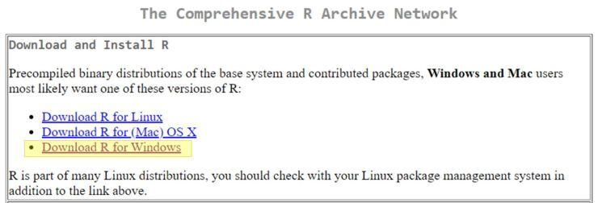

3. En la nueva página seleccione “base”.

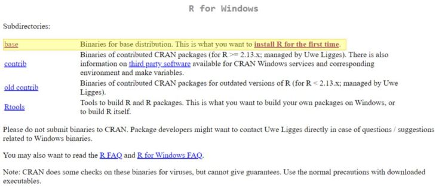

4. En la nueva página presiona en “Download R X.X.X for Windows”, donde X.X.X corresponde a la versión más actualizada disponible en ese momento. Para este caso es 4.0.3.

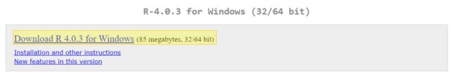

5. El archivo instalador empieza a descargarse como cualquier otro documento, la ubicación de la descarga y la forma en que se realice dependerán de la configuración que estés usando en tu navegador de internet.

6. Una vez que la descarga se complete, ejecuta el archivo de instalación desde la carpeta donde se haya almacenado.

7. Selecciona el idioma de preferencia y presiona OK.

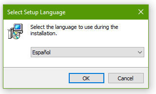

8. Sigue las recomendaciones de la pantalla y luego presiona “Siguiente”.

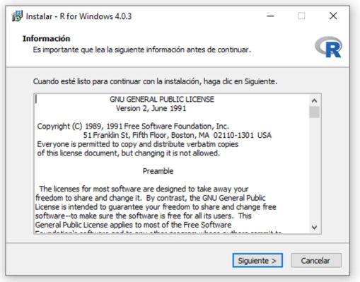

9. Selecciona la carpeta donde quieres instalar R. La recomendación es dejar la carpeta que viene por defecto. Luego, presiona “Siguiente”.

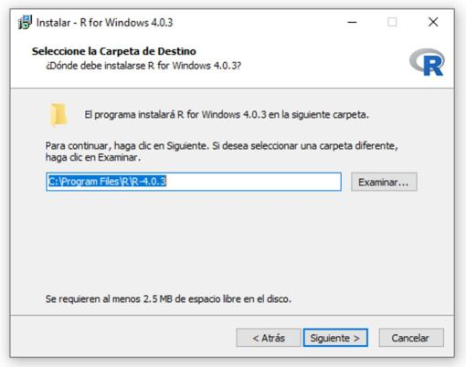

10. Selecciona los componentes que desea instalar. Es recomendable dejar seleccionados los que vienen por defecto. Luego, presiona “Siguiente”.

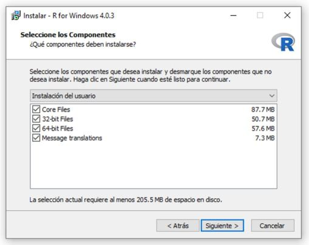

11. Especifica las opciones de configuración. En este caso, como es la instalación básica, la opción sugerida es “No”. Luego, presiona “Siguiente”.

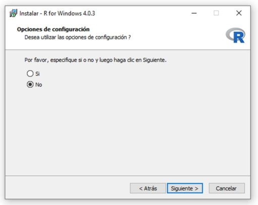

12. Lee las indicaciones y selecciona las opciones de su conveniencia. La sugerencia es dejar las opciones que vienen por defecto. Luego, presiona “Siguiente”.

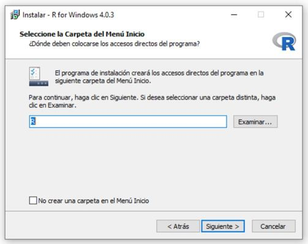

13. Selecciona las tareas adicionales. La sugerencia es dejar habilitadas solamente las que vienen por defecto. Luego, presiona “Siguiente”.

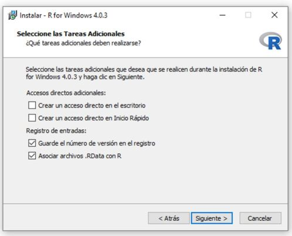

14. Esto iniciará el proceso de instalación. No cierres la ventana hasta que el programa indique que el proceso ha sido completado con éxito.

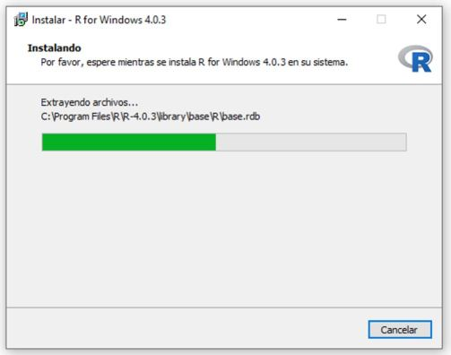

15. Esto completa la instalación de R. Presiona “Finalizar”.

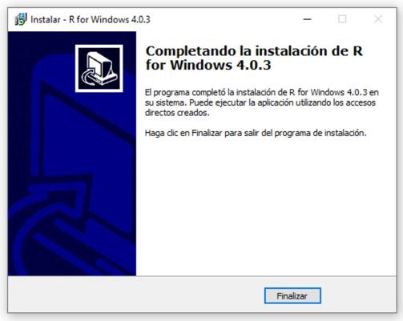


### Instalación de R Studio en Windows

Vamos ahora a proceder con R Studio.

1. Abre el siguiente enlace https://R Studio.com/products/R Studio/download/#download

2. En esta página, se indica lo siguiente:

2.1. Install R: Se requiere que R esté preinstalado. La versión más antigua soportada es 3.0.1, si se siguieron los pasos descritos anteriormente para la instalación de R tendríamos la versión más nueva, por lo que no tendríamos problema.

2.2. Download R Studio Desktop: R Studio provee un instalador sugerido basado en su sistema. En la imagen de abajo el instalador sugerido es Windows porque es el sistema operativo detectado. Si el instalador coincide con su sistema operativo, haga click en el recuadro para iniciar la descarga. Si requiere otro instalador, mirar el punto 3.

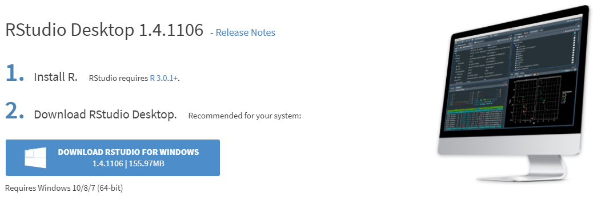

3. En caso de requerir instaladores para otros sistemas operativos, estos se pueden encontrar en el cuadro abajo de la imagen en la misma página “All Installers”.

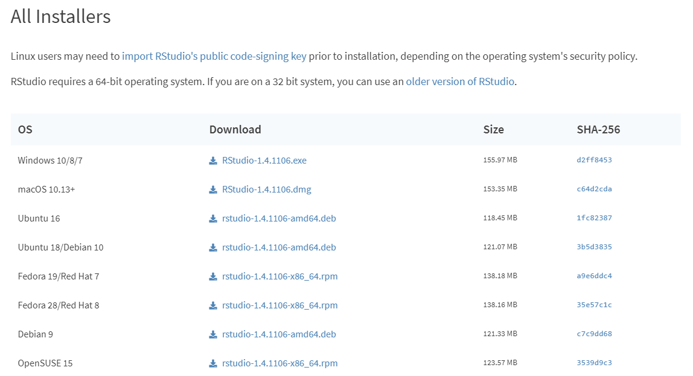

4. Después de seleccionar la descarga del instalador correspondiente, el archivo empezará a descargarse como cualquier otro documento, la ubicación de la descarga y la forma en que se realice dependerán de la configuración que estés usando tu navegador de internet.

5. Una vez que la descarga se complete, ejecuta el archivo de instalación desde la carpeta donde haya sido descargado.

6. La ventana de bienvenida indica que es recomendado cerrar todas las demás aplicaciones que se estén usando antes de iniciar la instalación. Esto es para que sea posible actualizar archivos importantes en el sistema sin necesidad de reiniciar el PC. Presiona “Next” cuando se haya completado lo anterior o si no hay inconveniente con reiniciar el PC.

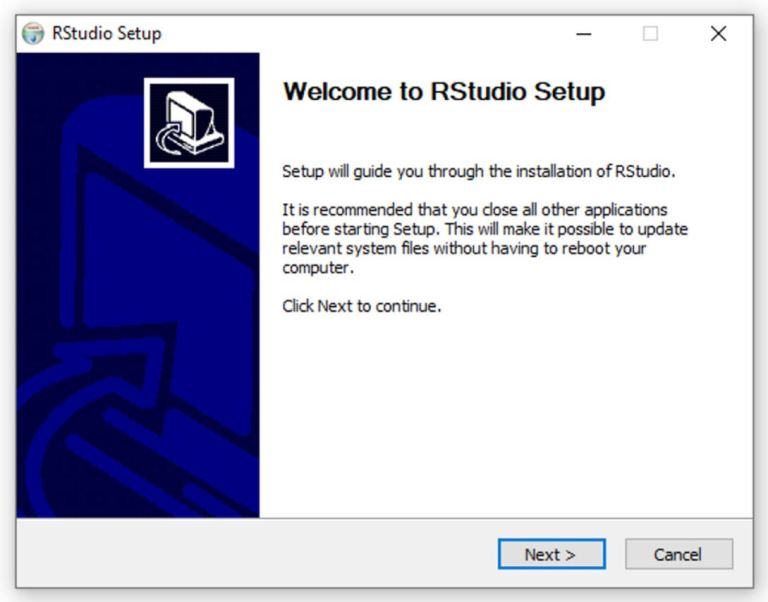

7. Seleccion la carpeta donde instalar R Studio. La recomendación es dejar la carpeta que viene por defecto. Luego, presiona “Next”.

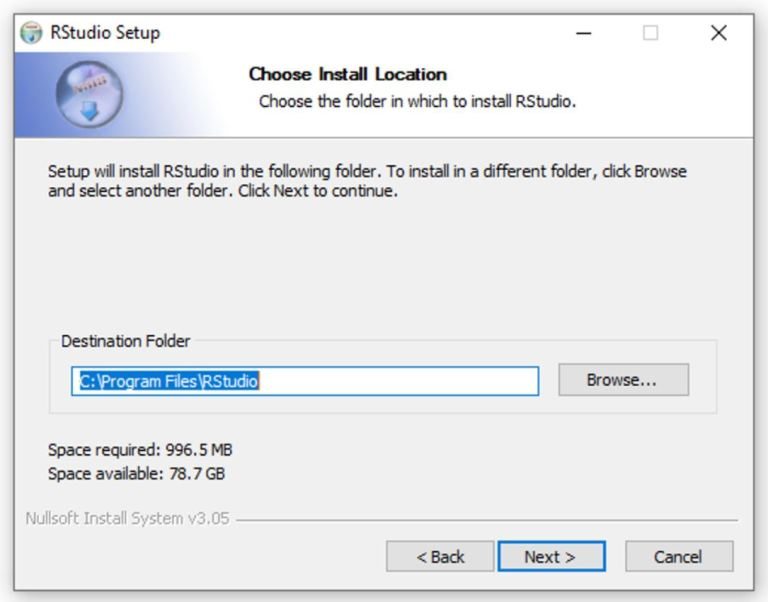

8. Selecciona la carpeta del menú de Inicio en el que se crearán los accesos directos al programa, o escribe un nombre para crear una nueva carpeta. La sugerencia es dejar las opciones que vienen por defecto. Luego, presiona “Install”.

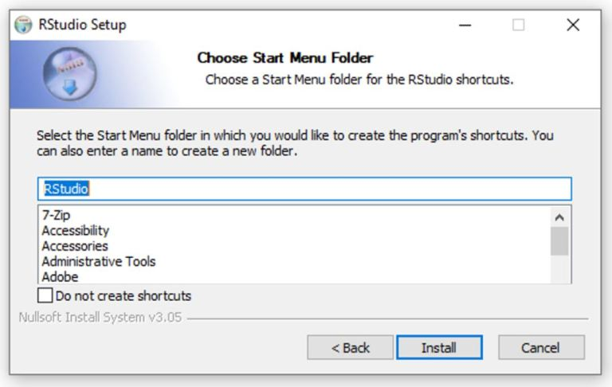

9. Esto iniciará el proceso de instalación. No cierres la ventana hasta que el programa indique que el proceso ha sido completado con éxito.

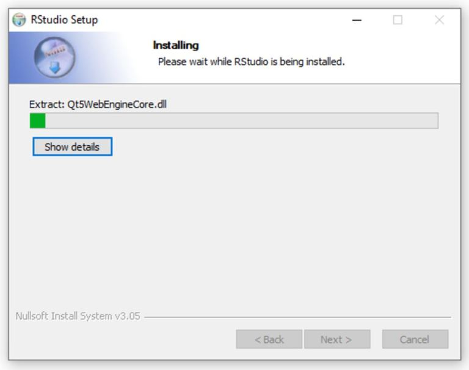

10. Esto completa la instalación de R Studio. Presiona “Finalizar”; es posible que debas reiniciar el PC dependiendo de lo establecido en el paso 6.

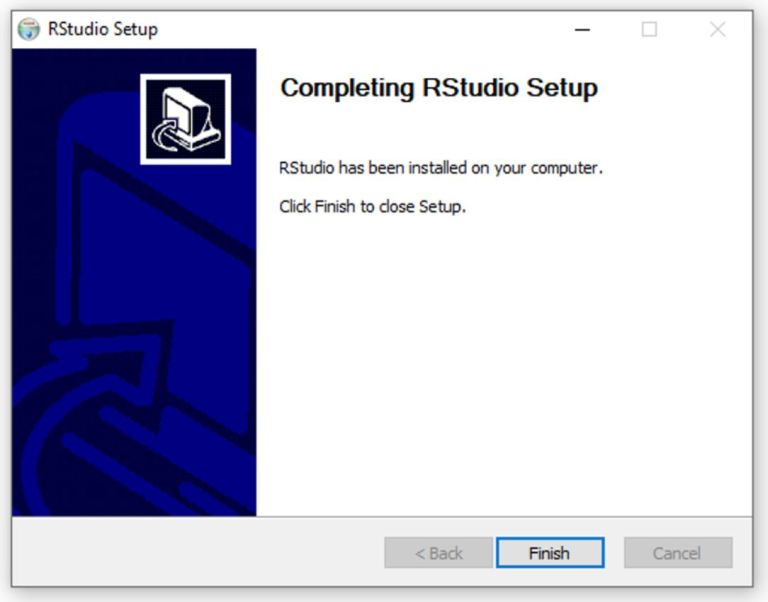

11. Tras el posible reinicio o sin el reinicio, lanza R Studio como cuqlquier otra aplicación. este es su aspecto.

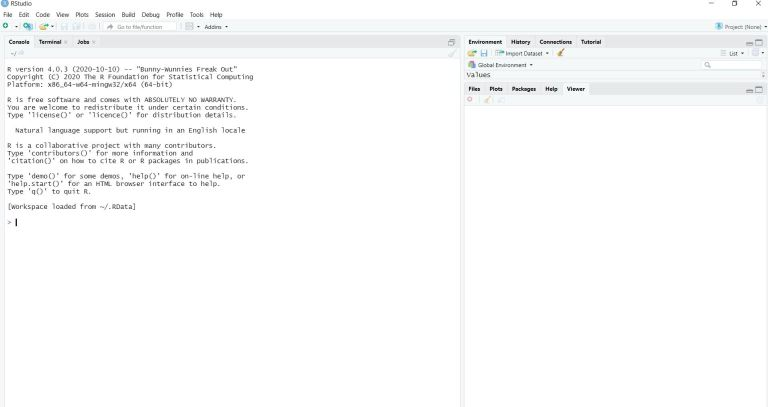

A partir de aquí continuamos. R Studio se encarga de gestionar R, no deberemos preocuparnos por éste salvo para actualizarlo cuando creamos necesario o tengamos alguna necesidad puntual. R y R Studio son como cualquier otra aplicación de Windows, harás lo mismo que con las demás.


## Uso básico de R Studio y de R

Si eres un lector / usuario que ya ha trabajado con R y R Studio, puedes saltar ya lo que resta de sección y pasar directamente a la sección 3. Si no lo eres, unas breves instrucciones para comenzar.

### ¿Qué es R Studio?: una interfaz para usar R

Cuando arrancamos R Studio, se pueden ver 4 ventanas, que según el gusto del usuario, pueden estar organizadas de diversa forma. En mi caso, me gusta disponer del editor de scripts o sintaxis ( _source_ ) en la parte superior izquierda, en la parte superior derecha la consola ( _console_ ) y abajo de izquierda a derecha el entorno ( _environment_ ) y a la derecha el resto de opciones ( _files_, _plots_, ...) en la parte superior el además de la barra de opciones en la parte superior.

Puedes adoptar esta configuración desde el menú **_Tools > Global Options > Pane Layout_**.

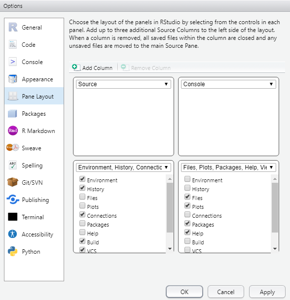
Mi escritorio ...

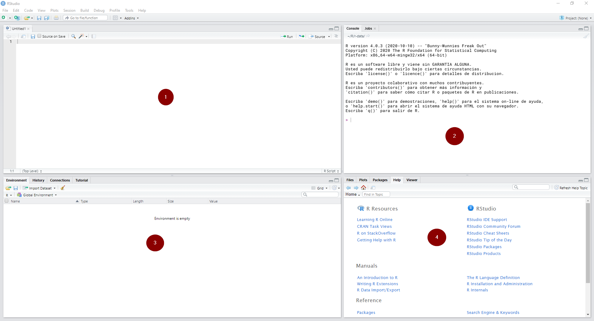

Ventana (1): es el editor de sintaxis: se trata del lugar donde editamos la sintaxis para posteriormente ejecutarla. Al escribir allí no sucederá nada, a no ser que se apriete algún botón para ejecutar los comandos o la tecla CTRL+ENTER.

Ventana (2): es la consola. Corresponde a lo que sería el software R en su versión básica. Allí el software ejecuta las operaciones realizadas desde el editor de sintaxis.

Ventana (4): es el “entorno de trabajo” del programa: en este lugar se muestra el conjunto de datos y los “objetos” (resultados, variables, gráficos, etc.) que se almacenan al ejecutar diferentes análisis.

Ventana (4) tiene varias sub pestañas: (i) la pestaña files permite ver el historial de archivos trabajados con el programa; (ii) la pestaña plots permite visualizar los gráficos que se generen; (iii) la pestaña packages permite ver los paquetes descargados y guardados en el disco duro así como gestionar su instalación o actualización; (iv) la ventana help permite acceder al CRAN - Comprehensive R Archive Network (siempre que se cuente con conexión a Internet), página oficial del software que ofrece diferentes recursos para el programa: manuales para el usuario, cursos on line, información general, descarga de paquetes, información de los paquetes instalados, etc. Esta última pestaña es bastante útil: empleando el motor de búsqueda se accede de manera rápida a manuales de uso de los diferentes paquetes (y sus funciones) instalados en el computador (esto no requiere conexión a Internet).7; (v) la ventana viewer muestra los resultados al construir reportes mediante funcionalidades tipo R Markdown que será nuestra herramienta de trabajo.

¿Dónde está nuestro trabajo? El software R funciona como un entorno temporal de trabajo, esto quiere decir que el usuario va agregando datos y objetos (conjuntos de datos con diferentes atributos) a una “hoja en blanco”. Hay que tener en cuenta que R trabaja con la memoria activa (RAM) del computador, por lo tanto cualquier análisis sólo mostrará la información resultante pero no permanecerá como archivo posible de utilizar de modo posterior. Es decir, si los análisis no son guardados como objetos (vectores, matrices, listas u otros tipos de objetos) se deberán repetir las instrucciones para obtener otra vez el resultado.

Todas las operaciones de R - sean indicadas vía sintaxis o botones - son ejecutadas según comando computacional que es visualizado en la consola. La ejecución de comandos entrega diferentes señales respecto a su funcionamiento. Por ejemplo, mientras se está ejecutando un comando, el programa muestra un signo “Stop” en la esquina superior derecha de la consola (como se ve en la imagen). Eso indica que el programa está ocupado ejecutando una acción. Si se presiona tal símbolo, se cancelará la operación en curso.

En la sección \@ref(tse02), comenzamos a trabar con sccripts que nos devuelvan resultados.
