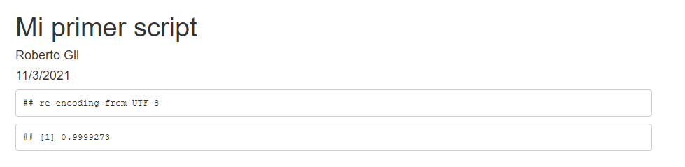

# Primeros pasos y términos a conocer {#tse02}

```{r include = FALSE}
if(!knitr:::is_html_output())
{
  options("width"=56)
  knitr::opts_chunk$set(tidy.opts=list(width.cutoff=56, indent = 2), tidy = TRUE)
  knitr::opts_chunk$set(fig.pos = 'H')
}
```

## ¿Desde dónde creo mis scripts?

Te explicamos brevemente las dos formas de trabajar.

### Scripting en consola

El scripting con consola está pensado para obtener tablas u otros objetos en la consola de la interza de trabajo de R Studio. Para ello usaremos archivos de texto con extensión .R que crearemos desde la entrada _File > New File > R Script_. Estos ficheros darán como resultado salidas a la denominada consola.

### Scripting con _markdown_

El scripting con _markdown_ está pensado para generar páginas completas o documentos completos con texto, tablas, gráficos, etc. Se pueden utilizar paquetes como `flexdashboard` o generar salidas de tipo diapositiva utilizando las opciones de configuración que ofrece el paquete `rmarkdown`. No aseguramos una compatibilidad al 100%, pues eso sería imposible, pero gran parte de las características estarían funcionales. La idea es generar un documento HTML, de forma totalmente transparente para el usuario que se guarda en la base de datos y se presenta como resultado del análisis. Ese HTML puede contener texto, gráficos, tablas y cualquier elemento que se te ocurra. El código R se ubica en lo que se denomina `chunks` que luego veremos y se puede incluir también código R `inline` en el texto. Para ello usaremos archivos de texto con extensión .Rmd que crearemos desde la entrada _File > New File > R Markdown_. Estos ficheros darán como resultado archivos con extensiones .html, .docx, .pdf .

## Primeros pasos

Si ya tienes experiencia con R Studio, da un vistazo, pero es posible que mucho de lo aquí indicado sea irrelevante para ti y todo ello ya sea habitual y conocido por ti. Pasa a la siguiente sección, donde comenzamos a trabajar los scripts.

### Carga de datos 

Vamos a trabajar con ello y verás que sencillo. Para comenzar, en [este enlace](https://drive.google.com/a/investigaonline.com/file/d/1JjevbQjzGc1NMyR7qf7bbvtbMyK8Pvhr/view?usp=drive_web) tienes un archivo de datos con el que haremos todos nuestros ejemplos. Esta fuente de datos está en formato SPSS (sav) y se corresponde con la tercera oleada de un estudio del CIS (Centro de Investigaciones Sociológics de España) de 2017, el barómetro sanitario. 
La fuente de datos tiene 2557 registros y tiene 190 campos. Si deseas ver el cuestionario que originalmente se utilizó para recoger los datos, [lo puedes descargar aquí](https://drive.google.com/a/investigaonline.com/file/d/1AUUI-1isOmKB1ovR4MRoqMj2Fp7Re2f2/view?usp=drive_web). En él puedes ver todo lo referente a como se ha realizado la entrevista.

Si has seguido las instrucciones de instalación, se habrá creado una carpeta denominada R dentro de Mis Documentos (que R Studio denomina Home como podás observar en e panel de la ventana 4, opción FILES)

A partir de ahí,impera tu orden, agrega carpetas en la forma en que esté habituado y organiza tu trabajo como si de cualquier aplicación Windows se tratara. Si te gusta ser ordenado en tu trabajo, lo harás también; si no te gusta, ...

Nuestro primer paso será iniciar una sintaxis o script. Para ello desde el menú de **_File > New File > R Script_** abriremos un espacio para escribir. En la ventana creada como _Untitled1_, puedes escribir.


escribe 2+2 y haz clic en _Run_ teniendo el cursor sobre la línea en la que has escrito ...


y obtendrás el resultado en la consola (ventana 2)


Ahora podrías guardar tu script, y ya tendríamos cerrado el primer paso del camino. El archivo puede editarse y volver a ejecutarse tantas veces quieras.

### Instalación de paquetes

Una de las cuestiones básicas de R es que se trabaja con paquetes que la comunidad de desarrollo aporta para los análisis más variados. Nosotros vamos a trabajar con algunos que no están en a instalación base, asi que deberemos instalarlos. Aunque existe opción de instalar paquetes por comandos, ilustramos el camino para hacerlo desde el menú. **_Tools > Install packages_**.


Utiliza la opción arriba indicada y siguiendo las indicaciones descritas escribiríamos:

expss, highcharter, kableExtra

Cuando hagas clic en _install_ comenzarán a instalarse esos paquetes.

## Crear un fichero R Markdown

Vamos a crear un nuevo script, pero ahora ya lo vamos a hacer del modo que seguiremos trabajando durante todo el manual. Desde el menú de R Studio **_Files > New File > R Markdown_**. Elige entre las opciones proporcionadas, la creación de un documento HTML. Dale nombre y pon tu nombre como autor. Verás lo que escribas reflejado en el archivo.


Se creará un archivo como este ...


Este es un fichero de ejemplo, borra desde donde pone ## R Markdown hasta abajo y que quede así.


Aquí escribimos el script de R, que como puedes ver en línea 1 y 3 comienza y acaba con una simbología determinada. Estos son los caracteres indicadores de que todo lo que queda entre ` ```{r echo=TRUE}` y ` ``` ` es scripting. A partir de ahora, nuestras instrucciones irán siempre entre estos símbolos de inicio y final. Nótese que se añade la instrucción `echo=TRUE`. Esta instrucción provocará que se imprima en el resultado los comandos del script, si en lugar de eso se escribe `echo=FALSE`, no se imprimiría ese código.

Nuestro código dice secuencialmente ...

* carga el paquete expss;
* lee el archivo que está en esa URL (un archivo SAV - SPSS en Google Drive) y asígnalo a un objeto de R que lo contendrá llamado data;
* se calcula la media (mean);
* de una variable que está en el marco de datos denominado `data`;
* y que se llama PESO (`data$PESO`);
* no teniendo en cuenta los valores NA (nulos, no definidos, que no sean número: `na.rm=TRUE`)

```{r }
library(expss)
data <- read_spss("https://drive.google.com/uc?export=download&id=1JjevbQjzGc1NMyR7qf7bbvtbMyK8Pvhr")
mean(data$PESO, na.rm=TRUE)
```

Quedará así: 


Para ver el resultado, haz clic en el botón KNITR (publicar). Como es la primera vez y no hemos guardado nuestro script, nos indica que le pongamos nombre, por ejemplo SCRIPT_001.


Y el resultado, ya puedes verlo, 0,9999273; sale en una nueva ventana que es onde se muestra el resultado. Reconocerás también aquello que se ha escrito cuando creamos el archivo y que puede editar sobre el fichero. 


Fíjate que se ha publicado el código R de programación eso lo podemos evitar si cambiamos el echo = TRUE por echo = FALSE. Prueba a hacer el cambio y haz de nuevo _`knitr`_.



Terminamos con el primer script de análisis. Este script aparece ahora en el listado de fichero como SCRIPT_001.Rmd (Rmd es la extensión de los archivos R Markdown, mientras que R es la de los scripts de consola). Del mismo modo, podrás ver ahora un archivo denominado SCRIPT_001.html que contiene tu resultado y que podrías copiar o enviar a cualquiera porque contiene todo lo necesario para que se muestre como a ti. Una de las grandes ventajas.

### Conclusión

Así, hemos finalizado con nuestro primer _scripting_. No volveremos a ser tan explicativos en este documento acerca de como crear y editar los scripts. En la siguiente sección comenzamos con las tablas más básicas.

## Básicos de R y/o proceso de datos

En el presente epígrafe, mostramos un conjunto de términos que serán habitualmente utilizados en las sucesivas secciones que se presentan en este documento. Estos son los más relevantes y los hemos separado en dos grupos. Un grupo hace referencia a términos básicos de R y otro grupo a términos básicos del manejo de tablas o del proceso de tabulación. Cada término tiene une breve reseña, y posteriormente algunos de ellos serán más tratados en sus respectivas funcionalidades. 

1. **R** es un entorno y lenguaje de programación con un enfoque al análisis estadístico. R nació como una implementación de software libre del lenguaje S, adicionado con soporte para alcance estático. Se trata de uno de los lenguajes de programación más utilizados en investigación científica, siendo además muy popular en los campos de aprendizaje automático (machine learning), minería de datos, investigación biomédica, bioinformática y matemáticas financieras. A esto contribuye la posibilidad de cargar diferentes bibliotecas o paquetes con funcionalidades de cálculo y graficación. R es parte del sistema GNU y se distribuye bajo la licencia GNU GPL. Está disponible para los sistemas operativos Windows, Macintosh, Unix y GNU/Linux.

1. **objeto**, elemento creado desde comandos R y que puede ser reutilizado dentro de la programación del script. En este manual se usará como sinónimo de tabla en muchos casos, pues la mayoría de los objetos que crearemos serán tablas.
1. **_dataframe_**, fichero de datos, banco de datos; término con el que se conoce en R a la estructura tabular (filas y columnas) de una matriz de datos, donde las columnas son variables y las filas son registros.
1. **variable**, elemento de tipo vector que contiene los valores de una determinada observación, un valor en cada fila; debe entenderse en el contexto de la estructura tabular o _dataframe_.
1. **valores**, cada una de las diferentes celdas que componen un _dataframe_. Una variable toma un valor en cada fila y se representa en la celda.
1. **medidas**, valores de los que se pretende calcular estadísticos como la media, la desviación típica o la mediana entre otras. Suelen responder a escalas de tipo numérico (ordinal o métrico).
1. **dimensiones**, valores de los que se pretende calcular frecuencias y/o porcentajes.
1. **factores**, niveles, códigos, etiquetas de variable.
1. **NA**, es como R representa los valores nulos o ausentes. 
1. **valores** perdidos, missing values, valores ausentes; tal como hemos indicado en el término NA, así es como R representa este tipo de valores.
1. **paquete**, conjunto de funciones de las que el usuario hace uso para obtener un resultado en R; en nuestro caso particular principalmente usaremos el paquete EXPSS de R; 1. comando, instrucciones que se integran dentro de un chunk
1. **chunk**, conjunto de comandos que se escriben entre los símbolos ````{r} y ```` y que se ejecutan mostrando los resultados.

## Básicos de tabulación

En nuestro trabajo vamos a crear objetos de tipo tabla; una tabla es una estructura tabular, igual que un _dataframe_. De hecho, con nuestro trabajo utilizando el paquete EXPSS, vamos a generar tablas que serán _dataframe_ de tipo (clase) `etable`. Al ser un _dataframe_, podremos operar entre filas, columnas y celdas de forma lógica o aritmética utilizando funciones y comandos de R.

Dejamos este glosario de términos relacionados con las tablas que utilizaremos en esta guía.

1. **título** (caption), texto que se publicará sobre la tabla;
1. **pie** (footer), texto que se publicará bajo la tabla;
1. **fila**, cada una de las líneas de información dentro de una tabla; se suele asimilar a un nivel (código) de una variable y/o a un resultados estadístico de una variable;
1. **columna**, cada una de las variables que conforman el _dataframe_ de una tabla (estructura tabular); en un cuadro o tabla de contingencia suele equivaler a un nivel de la variable que originalmente se diseñó para ser usada en columnas (si por ejemplo SEXO, una columna sería hombre y otra mujer);
1. **celda**, cada una de las unidades de información del cuadro o tabla;
1. **row_labels**, primera columna donde se escriben los textos de las filas y que sirven para identificar el contenido de las mismas;
1. **etiqueta de variable**, texto extra identificativo de la variable usada en filas o columnas;
1. **etiqueta de valor**, texto del código identificativo de la variable usada;
1. **estadístico**, medida calculada;
1. **frecuencia**, tipo específico de medida calculada que significa número de veces en términos absolutos;
1. **porcentaje**, tipo específico de medida calculada que significa número de veces en términos relativos;
1. **`|`**, símbolo denominado `pipe` que en el paquete `expss` se utilizará para separar conjuntos de texto en una celda (o columna o fila);
1. **significación**, prueba estadística de contraste.
